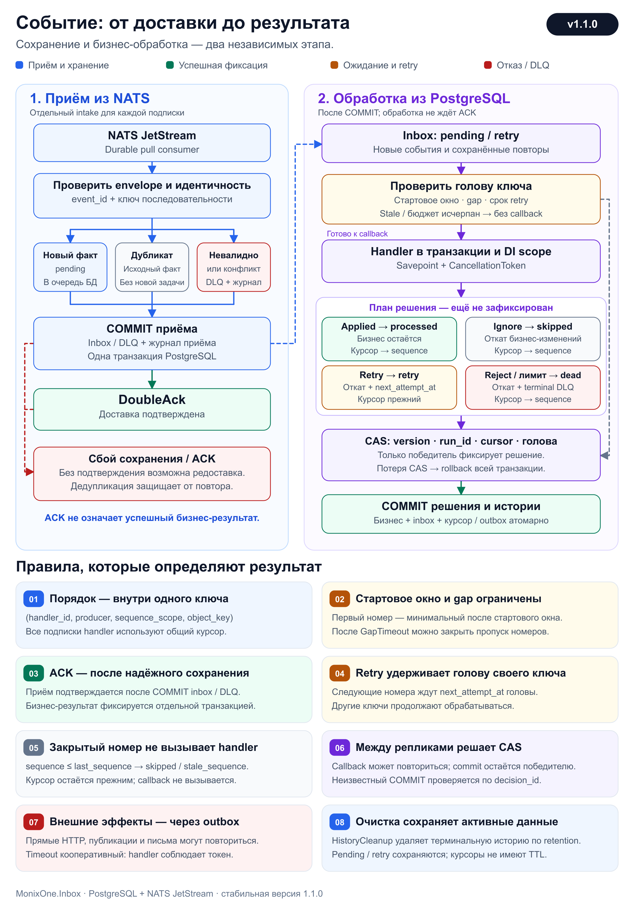

# 📬 MonixOne.Inbox

Ordered inbox для .NET 10, EF Core, PostgreSQL и NATS JetStream.
Пакет использует существующий application `DbContext`, собственную PostgreSQL schema
и durable pull consumers. Отдельные `DbSet` для inbox не нужны.

> [!NOTE]
> **Версия пакета:** `1.1.0`.

Приём сообщения и бизнес-обработка выполняются независимо:

1. **Intake** сохраняет полный envelope, исходные байты и метаданные доставки,
   затем отправляет JetStream DoubleAck.
2. **Dispatcher** обрабатывает сохранённые события в отдельных DI scopes.
   Один медленный объект оставляет свободные слоты для других объектов.

**Цветовые акценты:** 🟦 пояснения · 🟩 рекомендации · 🟪 ключевые правила ·
🟨 ограничения · 🟥 риски.

## 🧭 Содержание

- [🗺 Схема обработки события](#-схема-обработки-события)
- [🚀 Быстрый старт](#-быстрый-старт)
- [🔧 Конфигурация](#-конфигурация)
  - [🌳 Иерархия настроек](#-иерархия-настроек)
  - [🌐 OrderedInbox](#-orderedinbox)
    - [⚙ Defaults](#-defaults)
      - [🔁 Retry](#-retry)
    - [🏷 Handlers](#-handlers)
      - [📡 Subscriptions](#-subscriptions)
    - [🧹 HistoryCleanup](#-historycleanup)
- [🗃 Схема БД](#-схема-бд)
- [📨 Контракт сообщения](#-контракт-сообщения)
- [📤 Публикация и invalid_message](#-публикация-и-invalid_message)
- [🔢 Порядок обработки](#-порядок-обработки)
- [🧩 Обработчик и транзакция](#-обработчик-и-транзакция)
- [🔁 Дедупликация и ACK](#-дедупликация-и-ack)
- [🔎 История и диагностика](#-история-и-диагностика)
- [🧹 Очистка истории](#-очистка-истории)
- [📊 Метрики](#-метрики)
- [🧪 Проверка и пример приложения](#-проверка-и-пример-приложения)

## 🗺 Схема обработки события

Слева — приём сообщения из NATS, справа — независимая обработка сохранённого inbox.
Синий пунктир связывает этапы через COMMIT PostgreSQL:
сохранённое событие доступно dispatcher, даже если подтверждение ACK ещё не завершилось.



[Открыть SVG для масштабирования](docs/event-processing.svg).

> [!IMPORTANT]
> Dispatcher обрабатывает только `pending`/`retry`.
> Дубликат не создаёт новую бизнес-задачу; невалидное сообщение и конфликт сохраняются в intake DLQ.
> При конфликте исходный факт остаётся неизменным.

### 📌 Правила на схеме

1. **Порядок внутри ключа.** Курсор общий для
   `(handler_id, producer, sequence_scope, object_key)`.
   `subscription_id`, subject и транспортный `stream_sequence` в этот ключ не входят.
2. **Стартовое окно и gap.** У нового ключа выбирается минимальный доступный номер
   после `StartupReorderWindow`. При пропуске следующего номера ожидается `GapTimeout`.
   Пропущенный диапазон закрывается при фиксации более позднего terminal-решения.
3. **Сначала COMMIT приёма, затем ACK.** В одной транзакции сохраняются факт или DLQ и журнал доставки.
   Только после её успешного COMMIT отправляется DoubleAck.
   Ошибка или потеря подтверждения допускают безопасную редоставку.
4. **Retry удерживает голову ключа.** Следующие номера не обходят голову с будущим `next_attempt_at`.
   Другие ключи продолжают работу. `MaxAttempts` включает первую бизнес-попытку;
   исчерпание бюджета переводит событие в `dead` + terminal DLQ и закрывает его номер.
5. **Stale обходится без callback.** `sequence <= last_sequence` становится `skipped` / `stale_sequence`.
   Курсор остаётся прежним. Событие, пришедшее после закрытия gap, не применяется задним числом.
6. **Решение фиксируется через CAS.** Проверяются `version`, nullable cursor, `run_id` и актуальная голова.
   Бизнес-изменения, inbox, курсор и transactional outbox фиксируются одной транзакцией.
   Проигравшая реплика откатывает её целиком; неизвестный COMMIT проверяется по `decision_id`.
7. **Внешние эффекты через outbox.** Callback может повториться на другой реплике.
   HTTP-вызовы, публикации и письма выполняются через transactional outbox.
   `HandlerTimeout` отменяет операцию кооперативно: handler должен соблюдать `CancellationToken`.
8. **История очищается по retention.** [HistoryCleanup](#-historycleanup) удаляет подходящую terminal-историю
   и DLQ. Активные `pending`/`retry` и необходимая им история сохраняются;
   `consumer_state` и курсоры не имеют TTL.

## 🚀 Быстрый старт

### 📋 Требования к приложению

Приложение регистрирует scoped `DbContext` и singleton `INatsConnection`.
Оно же создаёт JetStream stream.

- Поддерживаются retention policies **Limits** и **Interest**.
- **WorkQueue** несовместима с независимыми handlers.
- Отсутствующие consumers создаются автоматически.
- Параметры существующих consumers проверяются без перезаписи.

### 🔌 Регистрация handler

```csharp
builder.Services.AddDbContext<AppDbContext>(options =>
    options.UseNpgsql(builder.Configuration.GetConnectionString("Application")));

builder.Services.AddSingleton<INatsConnection>(_ => new NatsConnection(
    NatsOpts.Default with { Url = builder.Configuration["Nats:Url"]! }));

builder.Services
    .AddOrderedInbox<AppDbContext>(builder.Configuration.GetSection("OrderedInbox"))
    .AddHandler<LocationsHandler>("locations", handler =>
    {
        handler.Subscribe("events", "DOMAIN_EVENTS", "events.locations.>", "locations");
    });
```

Несколько модулей могут добавлять handlers и подписки через повторный `AddOrderedInbox`
и `AddSubscription` до старта host.

Подписка может ссылаться на keyed singleton `INatsConnection` через `ConnectionName`.

Реплики одного handler используют одинаковые `handler_id` и durable names.
Разным handlers нужны отдельные durables.

## 🔧 Конфигурация

### 🌳 Иерархия настроек

Имена и вложенность соответствуют секции `OrderedInbox` в конфигурации приложения.
Каждый крупный блок ниже описывает свою область действия; его дочерние параметры —
значение по умолчанию, назначение и влияние на работу сервиса.

```text
OrderedInbox
├── Schema
├── AutoMigrate
├── Defaults                         ← общая политика обработки
│   ├── StartupReorderWindow
│   ├── GapTimeout
│   ├── PollInterval
│   ├── MaxParallelObjects
│   ├── IntakeConcurrency
│   ├── HandlerTimeout
│   ├── Retry                        ← повторные бизнес-попытки
│   │   ├── MaxAttempts
│   │   ├── InitialDelay
│   │   └── MaxDelay
│   └── ClassifyException            ← только C#
├── Handlers
│   └── <handler_id>                  ← отдельный логический потребитель
│       ├── Enabled
│       ├── StartupReorderWindow      ← переопределение Defaults
│       ├── GapTimeout
│       ├── PollInterval
│       ├── MaxParallelObjects
│       ├── IntakeConcurrency
│       ├── HandlerTimeout
│       ├── Retry
│       │   ├── MaxAttempts
│       │   ├── InitialDelay
│       │   └── MaxDelay
│       ├── ClassifyException         ← только C#
│       └── Subscriptions
│           └── <subscription_id>     ← транспортная подписка
│               ├── ConnectionName
│               ├── Stream
│               ├── Subject
│               ├── DurableName
│               └── BatchSize
└── HistoryCleanup                   ← общая очистка истории
    ├── Enabled
    ├── CompletedRetention
    ├── DeadLetterRetention
    ├── Interval
    └── BatchSize
```

`ClassifyException` входит в C# options, но в JSON не задаётся.
`<handler_id>` и `<subscription_id>` — ключи словарей, например `locations` и `events`.

### 📝 Пример настроек

```json
{
  "OrderedInbox": {
    "Schema": "ordered_inbox",
    "AutoMigrate": true,
    "Defaults": {
      "StartupReorderWindow": "00:00:01",
      "GapTimeout": "00:00:05",
      "PollInterval": "00:00:00.250",
      "MaxParallelObjects": 4,
      "IntakeConcurrency": 4,
      "HandlerTimeout": "00:00:30",
      "Retry": {
        "MaxAttempts": 5,
        "InitialDelay": "00:00:01",
        "MaxDelay": "00:01:00"
      }
    },
    "HistoryCleanup": {
      "Enabled": true,
      "CompletedRetention": "30.00:00:00",
      "DeadLetterRetention": "90.00:00:00",
      "Interval": "01:00:00",
      "BatchSize": 500
    },
    "Handlers": {
      "locations": {
        "Subscriptions": {
          "events": {
            "Stream": "DOMAIN_EVENTS",
            "Subject": "events.locations.>",
            "DurableName": "locations",
            "BatchSize": 32
          }
        }
      }
    }
  }
}
```

Показанные параметры обработки и очистки истории являются значениями по умолчанию.

### 🔀 Приоритет настроек

Конфигурация связывается один раз. Затем code overrides изменяют те же options
в порядке регистрации:

1. Общие делегаты `AddOrderedInbox`.
2. Настройки `AddHandler`.
3. Транспортные настройки `AddSubscription`.

> [!IMPORTANT]
> Эффективные параметры обработки складываются в следующем порядке:
> **встроенные значения → `Defaults` → конкретный handler**.
> Значение handler имеет приоритет, включая `Defaults`, заданные кодом.
> `null` или отсутствие nullable-параметра означает наследование предыдущего значения.

После построения catalog настройки неизменяемы. Для изменения требуется рестарт.

### 🌐 OrderedInbox

**За что отвечает.** Корневая секция объединяет хранилище inbox, общую политику обработки,
настройки handlers и очистку истории.

**На что влияет.** `Schema` и `AutoMigrate` определяют подготовку БД;
`Defaults` и `Handlers` — приём и бизнес-обработку; `HistoryCleanup` — хранение завершённой истории.
Область действия каждого дочернего блока описана отдельно ниже.

#### `Schema`

**Путь:** `OrderedInbox.Schema`.

**По умолчанию:** `ordered_inbox`.

**За что отвечает.** Задаёт PostgreSQL schema для таблиц inbox, курсоров, попыток, DLQ и журнала.
На схему бизнес-таблиц приложения не влияет.

> [!WARNING]
> **На что влияет.** Изменение выбирает другое хранилище inbox: прежние события и курсоры автоматически
> не переносятся.

Имя — до 63 ASCII символов: строчные буквы, цифры и `_`;
первый символ — буква или `_`, префикс `pg_` запрещён.

#### `AutoMigrate`

**Путь:** `OrderedInbox.AutoMigrate`.

**По умолчанию:** `true`.

**За что отвечает.** Разрешает установку схемы и недостающих миграций при старте host.
При `false` пакет только проверяет заранее установленную схему.

**На что влияет.** Влияет на способ подготовки БД и необходимые права учётной записи приложения.
При отсутствии схемы или обязательной миграции с `AutoMigrate=false` host не стартует.

#### ⚙ Defaults

**Путь:** `OrderedInbox.Defaults`.

**За что отвечает.** Задаёт общую политику порядка событий, опроса БД, параллелизма,
таймаута и повторных бизнес-попыток для всех зарегистрированных handlers.

**На что влияет.** Изменение применяется ко всем handlers, которые не переопределяют
соответствующий параметр. Собственное значение handler имеет более высокий приоритет.
Если значение не задано ни на одном уровне, используется встроенное значение ниже.

Те же параметры доступны непосредственно в `Handlers.<handler_id>`.
`Retry` вложен в оба уровня; его поля наследуются по отдельности.

##### `StartupReorderWindow`

**По умолчанию:** `00:00:01` — 1 секунда. **Допускает 0.**

**За что отвечает.** Задаёт время ожидания перед выбором первого номера нового ключа с `last_sequence=NULL`.
Окно отсчитывается от самого раннего `received_at` активных событий этого ключа.

**На что влияет.** Увеличение даёт больше времени на поступление ранних номеров, но задерживает первую
обработку.
При 0 ожидания нет: выбирается минимальный номер, доступный в момент выбора работы.
Для ключа с уже установленным курсором это окно не используется.

##### `GapTimeout`

**По умолчанию:** `00:00:05` — 5 секунд. **Допускает 0.**

**За что отвечает.** Задаёт ожидание отсутствующего `last_sequence + 1` после установления курсора.
Срок считается от самого раннего `received_at` активной очереди ключа,
а не от момента обнаружения пропуска.

**На что влияет.** Увеличение даёт пропущенному событию больше времени на доставку, но задерживает
последующие номера.
Уменьшение ускоряет закрытие gap; событие, пришедшее после продвижения курсора, станет stale.
При 0 gap можно закрыть сразу. Будущую дату retry головы этот параметр не обходит.

##### `PollInterval`

**По умолчанию:** `00:00:00.250` — 250 ms.

**За что отвечает.** Задаёт паузу слота dispatcher, когда доступной работы нет.
При успешной обработке слот сразу выбирает следующую работу без этой паузы.

**На что влияет.** Меньшее значение снижает задержку обнаружения готового события, но увеличивает число
запросов к БД.
Большее снижает частоту опроса, но добавляет задержку.
На NATS fetch и длительность бизнес-retry не влияет.

##### `MaxParallelObjects`

**По умолчанию:** `4`. **Минимум:** `1`.

**За что отвечает.** Задаёт число слотов dispatcher для одного handler на одной реплике.
Внутри процесса один ключ занят не более чем одним callback;
между репликами результат согласуется через CAS.

**На что влияет.** Увеличение позволяет обрабатывать больше разных объектов одновременно,
но повышает потребление соединений БД, нагрузку и возможную конкуренцию реплик.
Обработку одного ключа внутри процесса не ускоряет.

##### `IntakeConcurrency`

**По умолчанию:** `4`. **Минимум:** `1`.

**За что отвечает.** Ограничивает число параллельных операций сохранения и ACK **на подписку и реплику**.
Каждая операция использует отдельный scope и context.

**На что влияет.** Увеличение позволяет быстрее сохранять batch, но повышает пиковую нагрузку на БД и пул
соединений.
При нескольких подписках их лимиты действуют независимо.
На число бизнес-callbacks не влияет — ими управляет `MaxParallelObjects`.

##### `HandlerTimeout`

**По умолчанию:** `00:00:30` — 30 секунд.

**За что отвечает.** Задаёт deadline бизнес-попытки через переданный `CancellationToken`.
При `Applied` в него входит и финальный `SaveChanges` пакета.
Таймаут приводит к retry с кодом `handler_timeout` в пределах бюджета попыток.

**На что влияет.** Увеличение разрешает более долгие операции, но дольше удерживает слот и транзакцию.
Уменьшение быстрее отменяет зависшие операции, но может прерывать нормальную обработку.

> [!WARNING]
> Отмена кооперативная: если handler игнорирует токен, пакет ждёт его завершения.
> Это не таймаут NATS fetch и не замена command timeout приложения.

##### 🔁 Retry

**Пути:** `OrderedInbox.Defaults.Retry` и `OrderedInbox.Handlers.<handler_id>.Retry`.

**За что отвечает.** Управляет повторными бизнес-попытками уже сохранённого inbox:
бюджетом попыток и задержками перед повтором.

**На что влияет.** Определяет, сколько времени проблемное событие может занимать голову
своей последовательности и как часто будет повторяться обращение к бизнес-зависимостям.
После исчерпания бюджета событие становится `dead` и попадает в DLQ.

Политика не ограничивает переподключения инфраструктуры и повторные доставки NATS.
Частичное переопределение не сбрасывает другие поля: например, handler может задать только
`MaxAttempts`, продолжая наследовать `InitialDelay` и `MaxDelay` из `Defaults.Retry`.

###### `MaxAttempts`

**По умолчанию:** `5`. **Минимум:** `1`.

**За что отвечает.** Ограничивает число зафиксированных бизнес-попыток, включая первую.
Если последняя разрешённая попытка возвращает Retry, событие становится `dead` и попадает в DLQ.
При 1 первая неуспешная попытка уже исчерпывает бюджет.

**На что влияет.** Увеличение даёт больше шансов пережить временный бизнес-сбой,
но увеличивает нагрузку и время блокирования следующих номеров ключа.
Уменьшение быстрее завершает проблемное событие.
Infrastructure errors, ожидание sequence и проигранный CAS бюджет не расходуют.

После рестарта сохранённый `attempt_count` не сбрасывается.
Снижение бюджета ниже уже использованного числа попыток не даёт дополнительный callback.

###### `InitialDelay`

**По умолчанию:** `00:00:01` — 1 секунда.

**За что отвечает.** Задаёт базовую задержку первого автоматического retry.
Дальше база растёт экспоненциально до `MaxDelay`, со встроенным jitter 50–100%.

**На что влияет.** Увеличение снижает частоту повторных обращений к проблемной зависимости,
но задерживает восстановление обработки ключа.
Уменьшение ускоряет повторы и повышает нагрузку.

###### `MaxDelay`

**По умолчанию:** `00:01:00` — 1 минута.
Должен быть не меньше `InitialDelay`.

**За что отвечает.** Ограничивает растущую задержку автоматического retry.
Явный `retryAfter`, возвращённый handler, тоже ограничивается диапазоном от 1 ms до `MaxDelay`.
Для явной задержки автоматический jitter не применяется.

**На что влияет.** Увеличение позволяет реже повторять долго неуспешные операции,
но дольше задерживает последующие номера того же ключа.
Уменьшение ограничивает ожидание ценой более частых повторов.

##### `ClassifyException`

**По умолчанию:** `null` — бизнес-исключения дают Retry. **Задаётся только кодом.**

**За что отвечает.** Функция `Func<Exception, InboxResult>` выбирает Retry либо Reject для бизнес-исключения.
Reject сразу переводит событие в terminal DLQ;
Retry оставляет возможность повторной попытки в рамках бюджета.

**На что влияет.** Позволяет не тратить попытки на ошибки, которые повтором не исправить.
Функция должна выполняться быстро.
Её ошибка или неподдерживаемый результат дают диагностический fallback Retry.
`null` наследует правило предыдущего уровня.
Timeout, отмена host и потеря соединения не классифицируются как обычные бизнес-исключения.

#### 🏷 Handlers

**Путь одного обработчика:** `OrderedInbox.Handlers.<handler_id>`.

**За что отвечает.** Словарь настроек зарегистрированных C# handlers.
Каждый элемент объединяет включение обработчика, собственную политику обработки
и транспортные подписки, из которых он получает события.

**На что влияет.** Позволяет независимо включать handlers, задавать им разную нагрузку,
retry и источники сообщений. Состояние inbox и курсоры разделяются по `handler_id`.
При отсутствии собственных параметров обработки handler наследует `Defaults`.

> [!IMPORTANT]
> Запись в `Handlers` настраивает существующий C# handler.
> Его необходимо зарегистрировать через `AddHandler` с тем же id;
> неизвестный id в конфигурации приводит к ошибке старта.

##### `<handler_id>`

**Задаётся явно:** аргумент `AddHandler` и ключ `Handlers`, например `locations`.

**За что отвечает.** Определяет логического потребителя с собственным inbox, дедупликацией и курсорами.
Реплики одного handler должны использовать одинаковый id.

**На что влияет.** Изменение id создаёт другую область состояния и дедупликации.
Одной записи в конфигурации недостаточно: для id нужен C# handler, зарегистрированный через `AddHandler`.

**Формат ключа:** до 128 ASCII символов; первый — буква или цифра,
остальные — буквы, цифры, `.`, `_` или `-`.

##### `Enabled`

**По умолчанию:** `true`.

**За что отвечает.** Включает intake и dispatcher данного handler.
При `false` его новые сообщения не принимаются, а сохранённые события не обрабатываются;
таблицы и курсоры не удаляются.

**На что влияет.** Отключённому handler не нужны активные подписки, бизнес-зависимости и NATS-соединение.
Это отдельная настройка от `HistoryCleanup.Enabled`, которая управляет общей очисткой.

##### 🎛 Переопределения Defaults

**За что отвечает.** Уточняют общую политику для одного `handler_id`.
Параметры задаются прямо внутри `Handlers.<handler_id>`, без вложенного блока `Defaults`.

**На что влияет.** Остальные handlers продолжают использовать свои эффективные значения.
`null` или отсутствие поля сохраняет значение предыдущего уровня.

| Параметр handler | Что меняет для этого handler |
| --- | --- |
| `StartupReorderWindow` | Ожидание ранних номеров перед первой обработкой нового ключа. |
| `GapTimeout` | Ожидание пропущенного следующего номера. |
| `PollInterval` | Частоту опроса БД при отсутствии готовой работы. |
| `MaxParallelObjects` | Число параллельных бизнес-попыток для разных ключей на реплику. |
| `IntakeConcurrency` | Число параллельных сохранений на каждую подписку и реплику. |
| `HandlerTimeout` | Deadline одной бизнес-попытки. |
| `Retry.MaxAttempts` | Число разрешённых бизнес-попыток, включая первую. |
| `Retry.InitialDelay` | Базовую задержку автоматического retry. |
| `Retry.MaxDelay` | Верхнюю границу задержки retry. |
| `ClassifyException` | Выбор Retry/Reject для бизнес-исключений; задаётся только кодом. |

Подробные значения, ограничения и влияние увеличения/уменьшения параметров —
в блоке [Defaults](#-defaults).

##### 📡 Subscriptions

**Путь одной подписки:** `OrderedInbox.Handlers.<handler_id>.Subscriptions.<subscription_id>`.

**За что отвечает.** Словарь транспортных подписок конкретного handler.
Каждая подписка выбирает NATS-соединение, stream, фильтр subject, durable consumer
и размер входящего batch.

**На что влияет.** Определяет источники и объём входящих сообщений, а также сохранённую
позицию доставки каждой подписки. Несколько подписок одного handler используют общий
inbox и курсор для одинакового ключа производителя.

Активному handler нужна хотя бы одна подписка. Поля подписки не наследуются из `Defaults`;
они задаются в её конфигурации, `Subscribe` или `AddSubscription`.

###### `<subscription_id>`

**Задаётся явно:** аргумент `Subscribe`/`AddSubscription` и ключ `Subscriptions`, например `events`.

**За что отвечает.** Идентифицирует транспортную подписку в конфигурации, истории и метриках.

**На что влияет.** В ключ порядка и дедупликацию события не входит:
несколько подписок одного handler используют общий курсор производителя.

**Формат ключа:** максимум 128 ASCII символов; первый — буква или цифра,
остальные — буквы, цифры, `.`, `_` или `-`.

###### `ConnectionName`

**По умолчанию:** `null` — обычная singleton-регистрация `INatsConnection`.

**За что отвечает.** Выбирает DI key keyed singleton `INatsConnection`.
Позволяет направить подписку в другое зарегистрированное NATS-соединение.

**На что влияет.** Влияет на транспортный источник сообщений.
Соединением и его lifetime управляет приложение.
Пустая строка недопустима; для default-соединения параметр нужно опустить.

###### `Stream`

**Задаётся явно**, например `DOMAIN_EVENTS`.

**За что отвечает.** Выбирает существующий JetStream stream, из которого подписка получает события.
Пакет проверяет его совместимость и создаёт только consumer, а не сам stream.

**На что влияет.** Изменение переключает источник сообщений.
Поддерживаются Limits и Interest retention; WorkQueue несовместима с независимыми handlers.

###### `Subject`

**Задаётся явно**, например `events.locations.>`.

**За что отвечает.** Задаёт фильтр событий внутри stream.
Поддерживаются wildcard tokens `*` и финальный `>`.

**На что влияет.** Более широкий фильтр увеличивает число входящих сообщений и нагрузку;
слишком узкий может исключить необходимые номера и привести к gap.
Все необходимые номера исходного счётчика должны попадать в подписки handler.
`event_type` автоматически не фильтруется и не маршрутизируется.

Для существующего durable фильтр должен точно совпадать с конфигурацией consumer.
Пакет не перезаписывает несовместимый consumer, а останавливает старт.

###### `DurableName`

**Задаётся явно**, например `locations`.

**За что отвечает.** Определяет durable pull consumer и его сохранённую позицию доставки.
Реплики одной подписки используют одинаковое имя;
разные handlers одного subject — отдельные durables.

**На что влияет.** Изменение имени выбирает другой consumer.
Если его ещё нет, он создаётся с `DeliverAll`, поэтому возможна доставка доступной истории stream.
Дедупликация выполняется по сохранённому inbox и курсору.

###### `BatchSize`

**По умолчанию:** `32`. **Минимум:** `1`.

**За что отвечает.** Задаёт максимальное число сообщений одного NATS fetch.
Следующий fetch начинается после завершения операций сохранения текущего batch.
Одновременные операции ограничены `IntakeConcurrency`.

**На что влияет.** Увеличение уменьшает число fetch на тот же объём сообщений,
но позволяет получить больший batch и увеличивает его пиковый объём в памяти.
Уменьшение сокращает размер batch ценой более частых fetch.
Это отдельный параметр от `HistoryCleanup.BatchSize` и бизнес-параллелизма.

#### 🧹 HistoryCleanup

**Путь:** `OrderedInbox.HistoryCleanup`.

**За что отвечает.** Единая политика фоновой очистки завершённых сообщений,
DLQ и связанной истории попыток и журнала в schema пакета.

**На что влияет.** Определяет доступную глубину диагностики, объём таблиц,
частоту удаления и размер транзакций очистки.
Изменение сроков хранения влияет и на окно обнаружения повторного `event_id` в другом ключе.

**Область действия.** Все handlers в выбранной schema, включая историю отключённых handlers.
Блок задаётся на корневом уровне; он не входит в `Defaults` и не переопределяется для handler.
`consumer_state` и курсоры сохраняются без TTL.

> [!NOTE]
> Очистка запускается, только если `HistoryCleanup.Enabled=true` и есть хотя бы один
> включённый handler. Параметры блока проверяются при старте даже при отключённой очистке.

После успешного старта очистка выполняет первый цикл, затем повторяет его с заданным интервалом.
За цикл выполняется максимум 10 коротких batch с передачей управления между ними.
Это внутренний лимит, отдельной настройки для него нет.

##### `Enabled`

**По умолчанию:** `true`.

**За что отвечает.** Включает фоновое удаление истории.
При `false` приём и обработка продолжаются, но автоматическая очистка не запускается.

**На что влияет.** Отключение позволяет сохранить историю для разбора,
но объём таблиц будет расти. При отсутствии включённых handlers cleanup тоже не запускается.

##### `CompletedRetention`

**По умолчанию:** `30.00:00:00` — 30 дней. **Должен быть положительным.**

**За что отвечает.** Задаёт минимальный срок хранения завершённых `processed`/`skipped` по `completed_at`.
Свежая связанная DLQ и необходимость истории для курсора могут продлить фактическое хранение.

**На что влияет.** Увеличение расширяет доступную историю и окно обнаружения повторного `event_id` в другом
ключе,
но увеличивает объём БД.
Уменьшение быстрее освобождает место; курсор и защита от старого `sequence` сохраняются.

##### `DeadLetterRetention`

**По умолчанию:** `90.00:00:00` — 90 дней. **Должен быть положительным.**

**За что отвечает.** Задаёт срок хранения `dead` по `completed_at` и DLQ по `created_at`.
Связанные исходные сообщения и журнал сохраняются, пока нужны неистёкшей DLQ.
История, необходимая активным pending/retry, не удаляется.

**На что влияет.** Увеличение оставляет больше времени на разбор ошибок и конфликтов, но увеличивает объём БД.
Уменьшение раньше удаляет диагностические данные.

##### `Interval`

**По умолчанию:** `01:00:00` — 1 час.

**За что отвечает.** Задаёт интервал между циклами cleanup.
Истечение retention делает запись доступной для удаления,
но не гарантирует немедленное удаление: нужны очередной цикл и доступный batch.

**На что влияет.** Уменьшение чаще запускает очистку и сокращает задержку удаления,
но увеличивает частоту запросов к БД.
Увеличение уменьшает частоту работы cleanup и допускает больше накопившейся истории.

##### `BatchSize`

**По умолчанию:** `500`. **Минимум:** `1`.

**За что отвечает.** Ограничивает выборку inbox и выборку DLQ в одной транзакции cleanup.
За один batch могут быть выбраны до `BatchSize` событий и отдельно до `BatchSize` DLQ
(при значении по умолчанию — до 500 каждого вида).
Их зависимые journal/attempt rows удаляются в той же транзакции.
Это не лимит общего числа удаляемых строк.

**На что влияет.** Увеличение позволяет быстрее убирать накопленную историю,
но увеличивает размер транзакции, число блокировок и пиковую нагрузку.
Уменьшение делает транзакции короче, но для того же объёма нужно больше batch или циклов.

> [!TIP]
> `HistoryCleanup.Enabled` управляет очисткой, а `Handlers.<handler_id>.Enabled` — приёмом
> и бизнес-обработкой. Аналогично, `HistoryCleanup.BatchSize` ограничивает выборки очистки,
> а `Subscriptions.<subscription_id>.BatchSize` — число сообщений одного NATS fetch.

Подробности сохранения связанной истории, конкуренции и дедупликации —
в разделе [«Очистка истории»](#-очистка-истории).

### 📏 Допустимые интервалы

Для `PollInterval`, `HandlerTimeout`, `Retry.InitialDelay`, `Retry.MaxDelay`
и `HistoryCleanup.Interval` минимум — 1 ms.
`StartupReorderWindow` и `GapTimeout` допускают 0.

Максимум этих интервалов — 4 294 967 294 ms, около 49,7 дня,
из-за ограничений .NET таймеров.
Сроки хранения истории должны быть положительными; это ограничение таймеров на них не распространяется.


## 🗃 Схема БД

Схема устанавливается и проверяется **до запуска intake**.
При `AutoMigrate=false` схема должна быть установлена заранее.

### 🛠 Установка и валидация

- Нумерованные SQL-скрипты исполняются транзакционно с checksum.
- Несовпадающий checksum, неизвестная версия или нарушение необходимых ограничений
  останавливают старт.
- Имена constraints проверяются вместе с их определениями.

### 🗃 Доступ к данным

Прикладные запросы построены через **linq2db**:

- intake и сохранение DLQ;
- выбор событий и CAS курсора;
- cleanup;
- проверка PostgreSQL catalog.

`ON CONFLICT DO NOTHING` и `FOR UPDATE SKIP LOCKED` добавляются хинтами.
PostgreSQL-функции и jsonb-операции задаются типизированными SQL mappings.

Raw SQL остаётся для DDL установки схемы и неизменяемых миграций.

## 📨 Контракт сообщения

### 📦 Формат envelope

> [!IMPORTANT]
> По умолчанию тело NATS-сообщения — **один JSON-объект в UTF-8**.
> Семь служебных полей находятся **в корне**.
> Имена регистрозависимы и записываются в `snake_case`.

Следующий JSON валиден для стандартного парсера:

```json
{
  "event_id": "profile:updated:42:157",
  "producer": "profiles",
  "sequence_scope": "profiles",
  "object_key": "42",
  "sequence": 157,
  "event_type": "profile.updated",
  "occurred_at": "2026-10-09T07:00:00Z",
  "payload": { "name": "Example" }
}
```

### 📋 Поля сообщения

| Поле | Обязательно | JSON-тип | Назначение |
| --- | --- | --- | --- |
| `event_id` | Да | string | Стабильный идентификатор факта, уникальный внутри handler. |
| `producer` | Да | string | Стабильное имя производителя, которому принадлежит счётчик. |
| `sequence_scope` | Да | string | Область нумерации производителя. |
| `object_key` | Да | string | Ключ объекта внутри области, при необходимости с tenant/type. |
| `sequence` | Да | number | Положительный целочисленный номер производителя. |
| `event_type` | Да | string | Непустое имя события, например `profile.updated`. |
| `occurred_at` | Да | string | Дата и время ISO 8601 с явным часовым поясом. |
| `payload` | Нет | Любой JSON-тип | Бизнес-данные; их схему проверяет handler. |

### 📏 Ограничения полей

| Поле | Ограничение |
| --- | --- |
| `event_id` | До 512 UTF-8 байт; формат произвольный, UUID не обязателен. |
| `producer` | До 256 UTF-8 байт. |
| `sequence_scope` | До 256 UTF-8 байт. |
| `object_key` | До 1024 UTF-8 байт; числовой id тоже передаётся строкой: `"42"`. |
| `sequence` | От 1 до 9223372036854775807 (`Int64.MaxValue`); число `157`, без кавычек. |
| `event_type` | Отдельного лимита UTF-8 байт парсер не задаёт. |
| `occurred_at` | Например, `2026-10-09T07:00:00Z` или `2026-10-09T10:00:00+03:00`. |

При повторной отправке того же факта `event_id` **не меняется**.
`occurred_at` нормализуется в UTC до микросекунд PostgreSQL.

### 🔍 Проверка JSON

- Дополнительные поля допускаются и сохраняются.
- Служебные строки не могут быть пустыми, состоять только из пробелов или содержать NUL.
- Весь envelope должен быть совместим с PostgreSQL `jsonb`.
  Например, `\u0000` и числа вне диапазона PostgreSQL `numeric` недопустимы даже внутри `payload`.
- Стандартный JSON-парсер использует предел глубины 64.
- Комментарии и завершающие запятые не разрешены.

### 🧭 Область порядка и маршрутизация

Курсор независим для каждого ключа:

`(handler_id, producer, sequence_scope, object_key)`

`sequence` — номер производителя. JetStream `stream_sequence` его не заменяет.
`subscription_id` и subject в ключ порядка не входят.
Все необходимые события исходного счётчика должны попадать в подписки handler.

`handler_id` и `subscription_id` задаются при регистрации.
Добавлять их в тело сообщения не нужно; лимит каждого — 128 ASCII символов.

NATS subject выбирается по подписке и не обязан совпадать с `event_type`.
Inbox не маршрутизирует по полю `event_type`.

## 📤 Публикация и invalid_message

### 📤 Отправка JSON без повторной сериализации

> [!TIP]
> Если JSON уже собран в строку `json`, отправляйте его UTF-8 байты:

```csharp
var js = new NatsJSContext(connection);
var ack = await js.PublishAsync(
    subject,
    Encoding.UTF8.GetBytes(json),
    serializer: NatsRawSerializer<byte[]>.Default,
    cancellationToken: cancellationToken);
ack.EnsureSuccess();
```

Используются `System.Text`, `NATS.Client.Core` и `NATS.Client.JetStream`.
Subject должен попадать в stream и фильтр подписки.

Для приложения `examples/MonixOne.Inbox.Example`:

| Настройка | Значение |
| --- | --- |
| Stream | `HUB_EVENTS` |
| Фильтр | `hub.connect.>` |
| Пример subject | `hub.connect.profile.updated` |

### 🚫 Неподходящие форматы

Обёртка вида
`{"EventId":"...","Type":"...","Version":1,"OccurredAt":"...","Data":"{...}"}`
использует другой контракт.

Даже если строка `Data` содержит валидный envelope, стандартный парсер:

- не раскрывает её автоматически;
- не переименовывает поля;
- не находит корневой `event_id`.

Результат — `invalid_message` с reason
`Envelope extraction failed (KeyNotFoundException).`.

Также не подходит тело, содержащее JSON-строку `"{\"event_id\":...}"` вместо объекта.
Отправитель должен передавать envelope непосредственно как тело сообщения.

### 🔌 Адаптер внешней обёртки

Если внешняя обёртка нужна приложению, зарегистрируйте один scoped `IInboxEnvelopeAdapter` через DI.

1. Метод `Extract(JsonElement)` вызывается в scope intake.
2. Адаптер возвращает `InboxEventMetadata`; результат валидируется.
3. Адаптер может разобрать строку `Data` и извлечь из неё служебные поля.

> [!IMPORTANT]
> Полный JSON и исходные байты сохраняются без преобразования.
> **Handler тоже получает исходную обёртку**, поэтому бизнес-данные из `Data` он разбирает явно.

JSON Pointer настройки и delegate-handlers отсутствуют.

### 🔎 Диагностика отказа

Причину отказа можно прочитать через `InboxAdministration<TDbContext>.ReadDeadLetterAsync`
либо запросом к настроенной schema. Для схемы по умолчанию:

```sql
SELECT id, category, reason, jsonb_typeof(envelope) AS envelope_type, created_at
FROM ordered_inbox.inbox_dlq
WHERE category = 'invalid_message'
ORDER BY created_at DESC
LIMIT 20;
```

Невалидное сообщение подтверждается в JetStream после сохранения DLQ.
После исправления отправьте новое транспортное сообщение:
сохранённая DLQ сама не запускается повторно.

## 🔢 Порядок обработки

### 🌱 Новый ключ

У нового ключа `last_sequence=NULL`.
После `StartupReorderWindow` от самого раннего `received_at`
выбирается минимальный доступный активный номер.
Первое закрытое событие задаёт базу.

Примеры:

- Номер 157 обрабатывается без ожидания 1.
- Если за стартовое окно получены 157, 155 и 156, они закрываются в порядке 155, 156, 157.

### 🔢 Пропуск номера

После закрытия события ожидается `last_sequence + 1`.
При разрыве dispatcher ждёт `GapTimeout` от самого раннего `received_at` активной очереди,
затем выбирает минимальный доступный номер.

Закрытие 160 после курсора 157 атомарно сохраняет один `gap_skipped` для диапазона 158–159.
При `NULL` курсоре записывается `initial_sequence_selected`:
неизвестная предыстория не считается gap.

> [!IMPORTANT]
> **Retry не закрывает диапазон и не продвигает курсор.**

### 🔁 Retry и рестарт

Голова выбирается среди всех `pending`/`retry`, включая retry с будущим `next_attempt_at`.
Более поздний номер не обходит её. Остальные ключи продолжают работу.

Рестарт сохраняет:

- курсор;
- `received_at`;
- `attempt_count`;
- `next_attempt_at`.

Окна не начинаются заново.
Время уже полученных событий может означать, что ожидание следующего gap уже истекло.

### 📏 Поздние события и границы гарантии

Номер не выше закрытого курсора становится `skipped`/`stale_sequence` без callback.
Это относится и к повтору после очистки истории.
При `Int64.MaxValue` переполнения нет: любой допустимый номер уже stale.

Гарантия порядка относится к закрытым решениям и зафиксированным изменениям БД одного ключа.
Слишком позднее событие после закрытия gap теряет право на обработку.

Для зависимых дельт источник должен обеспечивать корректирующее событие или согласованный снимок.
Ограниченные окна не гарантируют доставку и применение всех номеров при произвольно большой задержке.

## 🧩 Обработчик и транзакция

### 🧩 Контракт handler

Handler реализует `IInboxHandler<TDbContext>`.
Переданный context совпадает с application context текущего scope
и участвует в транзакции inbox.

Handler может делать `SaveChanges` и raw SQL. Он не должен:

- самостоятельно завершать транзакцию;
- использовать другой context для бизнес-записей;
- переключать isolation level транзакции.

### 📋 Результаты обработки

| Результат | Бизнес-изменения | Inbox | Курсор |
| --- | --- | --- | --- |
| Applied | Commit | processed | Закрыть sequence |
| Ignore | Rollback к savepoint | skipped | Закрыть sequence |
| Retry в бюджете | Rollback к savepoint | retry | Без продвижения |
| Reject / исчерпан Retry | Rollback к savepoint | dead + DLQ | Закрыть sequence |
| Stale | Callback не вызывается | skipped | Без продвижения |

### 🔐 CAS и конкуренция реплик

После callback пакет проверяет:

- исходную `version`;
- nullable cursor;
- `run_id`;
- актуальную минимальную голову.

CAS выполняется в той же транзакции, что бизнес-данные и transactional outbox.
Проигравшая транзакция откатывается полностью.
`version` увеличивается для каждого зафиксированного решения, включая retry.

При intake и обработке нет advisory locks, `SELECT FOR UPDATE` вокруг callback,
leases и permanent blocking.
Внутри процесса занятые ключи исключаются неблокирующим набором.

На разных репликах callback может вызываться несколько раз и конкурентно.
Только победитель оставляет бизнес-изменения и outbox в БД.

### 🚦 Внешние эффекты и отмена

> [!CAUTION]
> Внешние эффекты допустимы только через **transactional outbox**.
> Прямые HTTP-вызовы, публикации и отправка писем из callback могут повториться.

Обработчики предназначены для ограниченных транзакционных операций
и обязаны соблюдать `CancellationToken`.
При игнорировании токена пакет ждёт фактического завершения callback
и сохраняет локальный занятый ключ.

### 🚧 Сбои и исключения

Транзакции используют primary PostgreSQL.
Координационные записи ограничены локальным `lock_timeout=100 ms` после бизнес-запросов;
таймауты запросов приложения не меняются.

Потери CAS, deadlock, serialization failure и contention возвращают слот к выбору работы
с коротким jitter.
При неизвестном COMMIT новый scope проверяет уникальный `decision_id`;
callback не повторяется в этом invocation.

Бизнес-исключение по умолчанию даёт retry.
Необязательный `ClassifyException` задаётся кодом и возвращает Retry либо Reject.
Ошибка классификатора даёт retry с диагностикой.

Timeout, отмена host и потеря соединения не классифицируются как обычная доменная ошибка.

Подробнее:
[транзакции и savepoints EF Core](https://learn.microsoft.com/en-us/ef/core/saving/transactions),
[PostgreSQL lock_timeout](https://www.postgresql.org/docs/current/runtime-config-client.html#GUC-LOCK-TIMEOUT).

## 🔁 Дедупликация и ACK

### 🪪 Идентичность факта

Уникальные ограничения защищают:

- `(handler_id, event_id)`;
- `(handler_id, producer, sequence_scope, object_key, sequence)`.

Insert выполняется атомарно с `ON CONFLICT`.
Одинаковый факт определяется метаданными и равенством envelope как PostgreSQL `jsonb`.
Форматирование и порядок полей JSON не влияют на дедупликацию.

### 🚧 Конфликт и невалидное сообщение

Первый успешно сохранённый факт остаётся исходным.
Другой payload при том же `event_id` или другой факт при том же `sequence`
сохраняются в conflict DLQ со ссылками на оригиналы.

Исходное событие не меняется, ключ продолжает обработку.

Некорректный payload сохраняется как `invalid_message` DLQ
с исходными байтами и delivery metadata. Его поля не продвигают курсор.

### 🤝 Подтверждение доставки

> [!IMPORTANT]
> **DoubleAck отправляется только после успешного COMMIT inbox или DLQ.**

При потере ответа COMMIT/ACK редоставка безопасна.
Краткая ошибка intake оставляет сообщение без ACK;
независимые уже начавшиеся сохранения могут завершиться.

Число операций и размер fetch ограничены.
Следующий batch не запрашивается до завершения текущего.
При отказе БД действует backoff.

Секретные headers редактируются до сохранения `source`.

## 🔎 История и диагностика

### 📒 Журнал попытки

`InboxDiagnostics` — scoped журнал попытки.
`Write` одновременно пишет в `ILogger` и буфер попытки.
Выключение `ILogger` не отключает долговечный журнал.

| Данные | Ограничение |
| --- | --- |
| Буфер диагностики | 128 записей / 64 KiB; переполнение отмечается `diagnostics.truncated`. |
| Details | 64 KiB и глубина 32. |

Некорректные, слишком большие, глубокие или несовместимые с jsonb данные
заменяются компактным fallback без изменения бизнес-решения.

### 📦 Хранение DLQ

| Категория | Где находятся входящие данные |
| --- | --- |
| Terminal DLQ | Ссылка на исходное событие без копирования envelope/raw/source. |
| Invalid / conflict DLQ | Собственные входящие данные. |

Для terminal DLQ payload доступен в Inbox страницы истории.

### 🔎 Чтение истории

Scoped `InboxAdministration<TDbContext>` предоставляет:

- `ReadHistoryAsync`;
- `ReadDeadLetterAsync`.

Пагинация выполняется по journal id, максимум — 200 записей.
Снимок события, состояния, попыток и DLQ читается в `RepeatableRead`.
Используйте отдельный scope вне callback.

Терминальное событие уже закрыто.
Исправление доменного состояния выполняется новым корректирующим событием.

## 🧹 Очистка истории

### 🔧 Настройка очистки

Иерархия блока, назначение каждого параметра, значения по умолчанию и влияние на нагрузку
описаны в [HistoryCleanup](#-historycleanup).
Ниже — правила сохранения данных и поведения очистки при конкуренции и сбоях.

### 📌 Какие данные сохраняются

- Связанная DLQ сохраняет необходимый исходный payload и историю
  до истечения собственного retention.
- Invalid/conflict DLQ без `inbox_id` тоже очищаются.
- Pending/retry и их необходимая история сохраняются.
- `consumer_state` и курсоры не имеют TTL.

### 🔐 Конкуренция и сбои

Несколько cleanup-воркеров работают идемпотентно с коротким `SKIP LOCKED`.
Foreign keys не отключаются.

Сбой БД логируется. Host продолжает работу и повторяет очистку в следующем цикле.

### 🔁 Дедупликация после очистки

> [!NOTE]
> Дедупликация старого `sequence` того же ключа сохраняется благодаря курсору.
> Обнаружение повторного `event_id` в другом ключе ограничено сроком сохранения истории.

## 📊 Метрики

### 📊 Counters и histograms

Meter: `MonixOne.Inbox`.

Counters решений охватывают:

- `received`, `duplicate`, `invalid_message`, `conflict`;
- `applied`, `ignored`, `retry`, `dead`, `stale`;
- `gap_skipped`.

Histograms измеряют длительность и задержку бизнес-попытки.

Labels: `schema`, `handler_id`, `subscription_id` и ограниченный `decision`.
`object_key` и `event_id` в labels отсутствуют.

### 📸 Снимок активных сообщений

Gauge `monixone.inbox.active_messages` читает снимок числа pending/retry.
SQL выполняется фоновым reporter каждые 15 секунд, вне exporter callbacks.

- До первого успешного чтения gauges отсутствуют.
- При ошибке сохраняется предыдущий снимок.
- Возраст снимка отражает `monixone.inbox.state_snapshot.age`.

### 🧮 Агрегация по репликам

> [!TIP]
> Gauges общей БД объединяются через **max**, counters — через **sum**.

## 🧪 Проверка и пример приложения

### 🧪 Сборка и тесты

```sh
dotnet restore MonixOne.Inbox.sln
dotnet build MonixOne.Inbox.sln -c Release --no-restore
dotnet test --solution MonixOne.Inbox.sln -c Release --no-build --no-restore
```

Для интеграционных тестов требуется Docker.
Testcontainers запускает PostgreSQL 18 и NATS 2.12 с JetStream.

Проверки охватывают:

- intake и DoubleAck;
- конкуренцию реплик и rollback бизнес-данных/outbox;
- сохранённые курсоры и окна;
- retry, terminal, conflict и stale;
- отмену и неизвестный COMMIT;
- диагностику, retention и ограничения схемы.

### 🔬 Планы запросов

`EXPLAIN ANALYZE` выбора головы и cleanup выполняется на следующих данных:

| Данные | Объём |
| --- | --- |
| Состояния | 50 000 |
| Завершённые события | 20 000 |
| Активные ключи | 20 |
| Связи DLQ/журнала в дополнительной проверке | 20 000 |

Отчёт сохраняется в `artifacts/inbox-query-plans.txt` тестового рабочего каталога.

### 💻 Пример приложения

`examples/MonixOne.Inbox.Example` регистрирует один handler `locations`
и работает до остановки host. Примерный handler возвращает Ignore.

До запуска нужно создать stream `HUB_EVENTS`, принимающий `hub.connect.>`.
Подключения задаются обычной .NET configuration.
